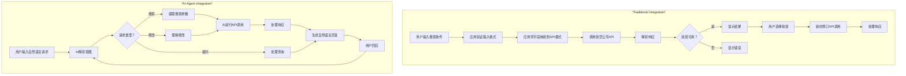

# 是时候开始为AI代理时代准备API了

[Fahim Muntashir](https://unsplash.com/@f12r?utm_content=creditCopyText&utm_medium=referral&utm_source=unsplash) on [Unsplash](https://unsplash.com/photos/a-man-using-a-laptop-computer-on-a-wooden-table-14JOIxmsOqA?utm_content=creditCopyText&utm_medium=referral&utm_source=unsplash).

软件工程领域一直以来都是以人类开发者为中心设计API的，他们具有可预测和一致的使用模式。但是，一种截然不同的新型API使用者正在迅速兴起：AI代理。

与人类开发者不同，AI代理的行为类似于线程。它们是基于任务的机器人，被启动以实现特定目标。完成任务可能需要它们按需建立API连接，查询API并关闭连接。随着AI代理的出现，集成不再是静态和不变的概念。独特的、短暂的[集成将成为](https://thenewstack.io/ai-has-become-integral-to-the-software-delivery-lifecycle/)常态。随着AI代理在数十种编码助手工具和平台中成为常态，问题不再是“是否”，而是“何时”API设计方法将随之改变。

**AI代理将如何改变API和应用程序开发**

### 无限的API调用

让我们以航班预订应用程序为例，来研究AI代理如何改变应用程序开发：

在这里，API使用的区别归结为确定性与非确定性。传统的应用程序从用户那里收集输入并进行一次API调用以显示结果。通常，用户的单个操作对应于单个API调用。

将其与AI代理应用程序进行比较，理论上，它对从单个用户请求可以进行的调用次数没有限制。它将继续迭代并进行多次甚至数十次调用，直到满足用户的请求。如果结果不令人满意，用户也可以重新提示代理。

**AI代理的细粒度安全**

在安全方面，连接模式和身份验证流程将发生转变。短期内，基于AI的应用程序应该会增加应用程序代表用户请求访问第三方API的实例数量。长期来看，AI代理的动态特性可能会产生更复杂的安全性方法。

例如，想象一下，一个AI代理需要访问您的日历来预订航班。它可能不会请求完全的日历编辑访问权限，而是接收一个临时的“微范围”权限，允许它检查与旅行计划相关的日期的可用性。这些微范围权限将在任务完成后过期，从而最大限度地减少安全攻击面。作为LLM的模型，OAuth可能会在一年内消亡。

**跨API管理上下文**

传统的API将每个请求视为隔离的，但AI代理在维护跨多个调用的对话上下文时会考虑更大的图景。

随着AI代理越来越需要在多个服务之间协调以完成任务，真正的[挑战在于跨不同API管理上下文](https://thenewstack.io/rest-vs-graphql-solving-api-challenges-in-modern-data-transfers/)。上下文将存储在哪里？谁需要知道它？目前，上下文存储在LLM中，它在发送API请求时会选择并选择需要共享的部分。但很容易想象未来会有标准化的“上下文块”，这样上下文就可以在多个API提供商之间共享和访问。

**如何为今天的AI代理做好准备**

AI代理仍处于早期阶段，未来6个月情况将发生重大变化。让我们看看您今天可以做些什么来为AI代理准备您的API。

**维护您的OpenAPI规范**

AI代理并不关心您的API文档是否漂亮。它们只关心您的OpenAPI规范是否正确、描述性强且最新。它们关心您的API接收什么数据以及输出什么数据。仅此而已。
如果您不熟悉OpenAPI，[它是一种描述REST API的标准](https://www.speakeasy.com/openapi#openapi-overview)。如果您有REST API，那么您很可能已经有了OpenAPI规范。但这套规范是否正确和最新，那就是另一个问题了。

如果您一直推迟更新规范，那么AI代理就是进行彻底清理的重要原因。大多数主要的AI代理框架（Langchain、LangGraph、Crew AI等）都使用OpenAPI作为LLM与您的API交互的媒介。如果您的规范不准确或含糊不清，您就是在破坏其他试图使用AI构建您的API之上的开发者。

**注意MCP**
11月，Anthropic宣布了[模型上下文协议](https://modelcontextprotocol.io/) (MCP)，试图改进当前使用OpenAPI的系统。虽然今天的API需要为每个想要访问它们的AI助手或代理进行独特的实现，但MCP提出了一种单一的服务器-客户端架构，它为[可供您的LLM访问的API](https://thenewstack.io/accessing-perplexity-online-llms-programmatically-via-api/)提供了一个简单的JSON模式。

对于API构建者来说，这预示着一种潜在的转变，即从构建AI专用端点或功能转向通过任何AI系统都可以使用的标准化MCP服务器公开其数据。

这可以极大地简化API处理AI集成的方式，并使其数据更容易被不断增长的AI工具和代理生态系统访问。

MCP是否会被广泛采用或成为Anthropic特有的，目前尚不清楚。但是，作为市场上最大的LLM提供商之一，您应该考虑构建一个MCP服务器，无论是否被广泛采用。为了使您的API可用，您必须创建一个精简的SDK，使其符合标准中概述的原则。

AI代理时代的API设计和使用将为开发者带来新的挑战和新的机遇。例如，人类开发者之间的API发现仍然是当今尚未解决的挑战，而AI代理可能会[解决或加剧这个问题](https://thenewstack.io/the-future-of-sql-conversational-hands-on-problem-solving/)。

但无论软件集成行业最终如何适应代理，开发者都必须开始奠定基础，为今天的代理做好准备。

[YOUTUBE.COM/THENEWSTACK 技术发展迅速，不要错过任何一集。订阅我们的YouTube频道，收看我们所有的播客、访谈、演示等等。](https://youtube.com/thenewstack?sub_confirmation=1)