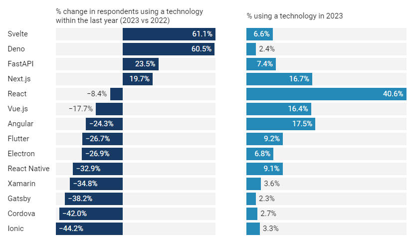

# 开发新闻: React 还是王者

翻译自 [Dev News： React Still King， Vercel AI Tools， Netlify Connect](https://thenewstack.io/dev-news-react-still-king-vercel-ai-tools-netlify-connect/) 。

Web 框架的使用量下降了，但 React 仍然占主导地位。此外，Vercel的 AI 计划， Netlify 的统一数据层和 Google 的脚本编辑器工具。

*照片来自Pexels*

根据最近的 [Stack Overflow 调查](https://survey.stackoverflow.co/2023/)，Web框架的使用总体下降了约 10% ，而特定框架的计划增加了约 15% 。

[Svelte](https://thenewstack.io/rich-harris-talks-sveltekit-and-whats-next-for-svelte/)、[Next.js](https://thenewstack.io/what-developers-told-us-about-vercels-next-js-update/) 和 [Deno](https://thenewstack.io/5-tips-to-build-like-a-pro-with-slacks-deno-sdk-and-new-cli/) 在 2023 年的采用率都有所增加，而 [React](https://thenewstack.io/learn-react-delete-functionality-and-the-set-state-hook/)、[Vue.js](https://thenewstack.io/meet-vue-js-flexible-javascript-framework/) 和 [Angular](https://thenewstack.io/google-engineer-outlines-whats-next-for-angular/) 的使用量都大幅下降。尽管使用量受到冲击，但 React 仍然是最受欢迎的 Web 框架，今年报告的总体使用量为 40.6% 。

用于移动应用程序的框架也大幅下降，例如 [React Native](https://thenewstack.io/google-flutter-now-rivals-facebooks-react-in-developer-use/) 下降了 33% ， [Flutter](https://thenewstack.io/google-roadmap-flutter-to-integrate-with-javascript-wasm/) 下降了 27% 。

### 一些 Web 和跨平台框架在 2023 年的使用量将大幅波动

*特别感谢 The New Stack 的分析师 Lawrence Hecht ，他为本报告做出了贡献。*

## Vercel 的 AI 加速和新的 AI 工具

今年前四个月，前端开发平台 [Vercel](https://vercel.com/dashboard) 在其平台上推出的 AI 业务增加了 800% 。

“我们意识到这里正在发生一些事情，社区和我们的客户对人工智能和大型语言模型感到非常兴奋，” [Vercel](https://thenewstack.io/vercel-offers-postgres-redis-options-for-frontend-developers/) 开发人员体验副总裁 Lee Robinson 告诉 The New Stack 。“我们一直在努力为他们从我们的平台和产品实际进入匝道铺平道路，以帮助他们建立更好的体验”

周三，该公司启动了一项[人工智能加速器计划](https://vercel.com/ai-accelerator)，该计划向有兴趣构建和扩展人工智能解决方案的个人人工智能开发人员和早期初创公司开放。参与者将能够利用人工智能专家的指导，并获得人工智能合作伙伴的资金和信贷。

40 名参与者将被选中参加为期 6 周的加速项目。他们将有机会通过壁炉会谈和办公时间获得来自领先 A I专家的 AI 辅导，并获得 Vercel 开发者体验团队的支持，后者将充当问责教练。

“Vercel 团队中的人们开发了许多 AI 应用程序，他们理解什么是出色的用户界面以及如何将这些工具组合在一起，” Robinson 说。“为这些构建者提供辅导，使他们开发出人们真正想要使用的产品，甚至有可能成为一家实际上可以获得融资的公司，这将会太棒了。”

11 个 AI 合作伙伴包括因 [ChatGPT](https://thenewstack.io/donald-knuth-asked-chatgpt-20-questions-what-did-we-learn/) 知名的 [OpenAI](https://thenewstack.io/beyond-chatgpt-exploring-the-openai-platform/) 、开源机器学习公司 [Hugging Face](https://thenewstack.io/hugging-face-aws-partner-to-help-devs-jump-start-ai-use/) 、 AI 安全和研究公司 [Anthropic](https://thenewstack.io/developers-put-ai-bots-to-the-test-of-writing-code/) 以及机器学习公司 [Replicate](https://replicate.com/) 。还有对新的 LangChain 评估平台的提前访问权限。这些合作伙伴公司将提供超过 85 万美元的信用额度，用于分配给加速项目的参与者。

“有时，这些 AI 模型(取决于它们试图构建的内容)在计算上可能非常昂贵，它们需要访问这些平台才能真正实现自己的想法，”他说。

The participants also will gain access to a CRV investor, who will provide office hours and a fireside chat for deck feedback and guidance.
参与者还将获得CRV投资者的访问权，他们将提供办公时间和炉边聊天，以获得甲板反馈和指导。

Vercel also announced its own AI support tools for customers, including:
Vercel还宣布为客户提供自己的AI支持工具，包括：

AI playground: An interactive place for developers to test and experiment with AI technologies without setting up local environments or deploying AI models on their own infrastructure.
AI 游乐场：开发人员无需设置本地环境或在自己的基础设施上部署 AI 模型即可测试和试验 AI 技术的交互式场所。
AI SDK: Vercel AI SDK is an open-source library designed to help developers build conversational streaming text and chat user interfaces in JavaScript.
AI SDK：Vercel AI SDK是一个开源库，旨在帮助开发人员在JavaScript中构建对话流文本和聊天用户界面。
Chatbot plugin: With the chatbot plugin, companies can develop and deploy their own chatbot solutions while maintaining control over their data. The robust and security features of Vercel ensure that sensitive company data remains protected while allowing organizations to deploy chatbot solutions at scale. The dominant way developers are building interfaces to AI is through chatbots, Robinson said.
聊天机器人插件：使用聊天机器人插件，公司可以开发和部署自己的聊天机器人解决方案，同时保持对其数据的控制。Vercel的强大和安全功能可确保敏感的公司数据受到保护，同时允许组织大规模部署聊天机器人解决方案。Robinson说，开发人员构建AI界面的主要方式是通过聊天机器人。
“We have a massive amount of developers who are really, really interested in AI,” he said. “Developers want to build these really awesome applications, so we’re trying to give them the infrastructure, the tooling and the workflow to do that.”
“我们有大量的开发人员对人工智能非常非常感兴趣，”他说。“开发人员希望构建这些非常棒的应用程序，因此我们正在努力为他们提供基础设施、工具和工作流程来做到这一点。

Netlify to Offer Unified Data Layer
网络化提供统一的数据层
Web development platform Netlify launched Netlify Connect on Tuesday, which will provide frontend developers with a “clean, headless Graph QL API on top of their different content sources,” Matt Biilmann, CEO of Netlify, told The New Stack.
Web开发平台Netlify周二推出了Netlify Connect，它将为前端开发人员提供“干净，无头的Graph QL API，”Netlify首席执行官Matt Biilmann告诉The New Stack。

Connect provides a unified data layer that will enable organizations who want to shift from a monolithic to composable architecture, the company said. Notify Connect enables real-time content distribution across all websites and applications globally, it added. Under the engine, Connect has a GraphQL API that allows users to connect content sources and caches at the edge.
该公司表示，Connect提供了一个统一的数据层，将使希望从单体架构转变为可组合架构的组织成为可能。它补充说，Notify Connect能够在全球所有网站和应用程序中实时分发内容。在引擎下，Connect 有一个 GraphQL API，允许用户在边缘连接内容源和缓存。

“Companies might adopt headless content platforms like Contentful, Sanity, or Contentstack to give their frontend teams more freedom, but at an enterprise scale, there are many different existing content sources, e-commerce platforms and CMS systems that will not be going away anytime soon,” Biilmann said. “A single data unification layer enables companies to decouple the frontend user experience layer from existing monolithic CMS and application platforms, giving web teams the freedom to create world-class websites, online stores, and applications with data from any existing or new content source.”
“公司可能会采用Contentful，Sanity或Contentstack等无头内容平台，以给他们的前端团队更多的自由，但在企业规模上，有许多不同的现有内容来源，电子商务平台和CMS系统不会很快消失，”Biilmann说。“单一数据统一层使公司能够将前端用户体验层与现有的单片CMS和应用程序平台分离，使Web团队能够自由地使用来自任何现有或新内容源的数据创建世界一流的网站，在线商店和应用程序。

Hack Your Home with New Google Script Editor Tool
使用新的Google脚本编辑器工具破解您的家
Google on Tuesday made available its script editor tool, which offers more automation for Google Home-powered smart products, the Verge reported this week. The script editor is part of the new home.google.com web interface and the new Google Home app preview, which started Wednesday.
据Verge本周报道，谷歌周二提供了其脚本编辑器工具，该工具为Google Home驱动的智能产品提供了更多的自动化。脚本编辑器是周三开始的新 home.google.com 网络界面和新的Google Home应用程序预览的一部分。

These automatons will allow developers to string together multiple devices to automate tasks, such as turning on the lights and playing music. The script editor also offers more advanced options for automation than are currently available in the existing Google Home app. Developers can apply for the public preview of the new Google Home app.
这些自动机将允许开发人员将多个设备串联在一起以自动执行任务，例如打开灯和播放音乐。脚本编辑器还提供了比现有 Google Home 应用中当前提供的更高级的自动化选项。开发者可以申请新版 Google Home 应用的公开预览版。

The average home now has 25 connected devices, Anish Kattukaran, director of product management at Google, noted in a blog post. That’s up from three devices nearly 10 years ago. But despite 10 years of progress, devices are hard to set up, don’t always perform when you need them to, don’t play well together, and you have to juggle multiple device apps, Kattukaran stated.
现在平均每个家庭有25个连接设备，谷歌产品管理总监Anish Kattukaran在一篇博客文章中指出。这比近10年前的三台设备有所增加。但是，尽管有10年的进步，设备很难设置，并不总是在需要时执行，不能很好地协同工作，而且你必须处理多个设备应用程序，Kattukaran说。

Google contends Matter, a new smart home connectivity standard, will help solve these problems. With Fast Pair for Matter, an Android phone will automatically detect a Matter device and help users set it up. Matter setup and app linking will be available by default on billions of Android devices with Google’s launch of Matter support later this year, he stated.
谷歌认为，新的智能家居连接标准Matter将有助于解决这些问题。使用快速配对，Android手机将自动检测Matter设备并帮助用户进行设置。他表示，Matter设置和应用程序链接将默认在数十亿台Android设备上可用，谷歌将于今年晚些时候推出Matter支持。

“We are even working directly with top device makers to ensure we have support across as many Matter-supported devices as possible,” Kattukaran wrote. “We’re also ​​updating our existing Google Nest smart speakers, smart displays and routers to control Matter devices.”
“我们甚至直接与顶级设备制造商合作，以确保我们在尽可能多的Matter支持设备上获得支持，”Kattukaran写道。“我们还在更新现有的Google Nest智能扬声器，智能显示器和路由器，以控制Matter设备。

The Google Home app supports Matter devices, Nest and 80,000 devices, Kattukaran said. The Google Home app provides a single place to set up, control and automate these home devices, he added.
Kattukaran说，Google Home应用程序支持Matter设备，Nest和80，000台设备。他补充说，Google Home应用程序提供了一个设置，控制和自动化这些家庭设备的单一位置。