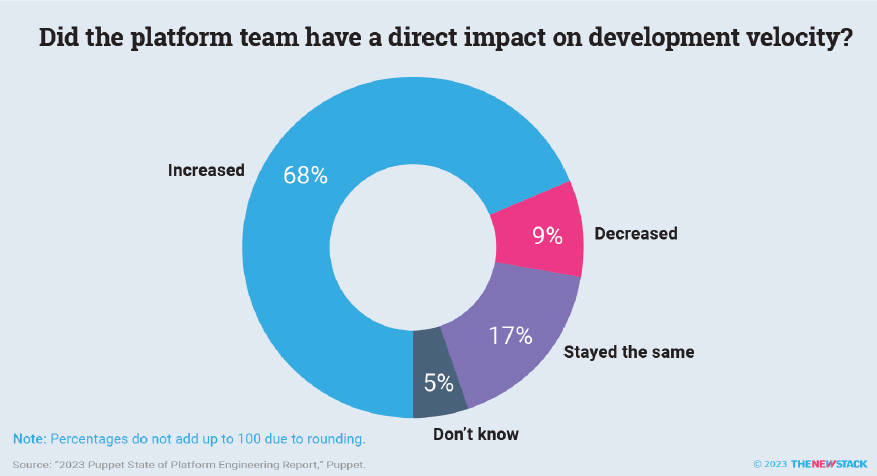
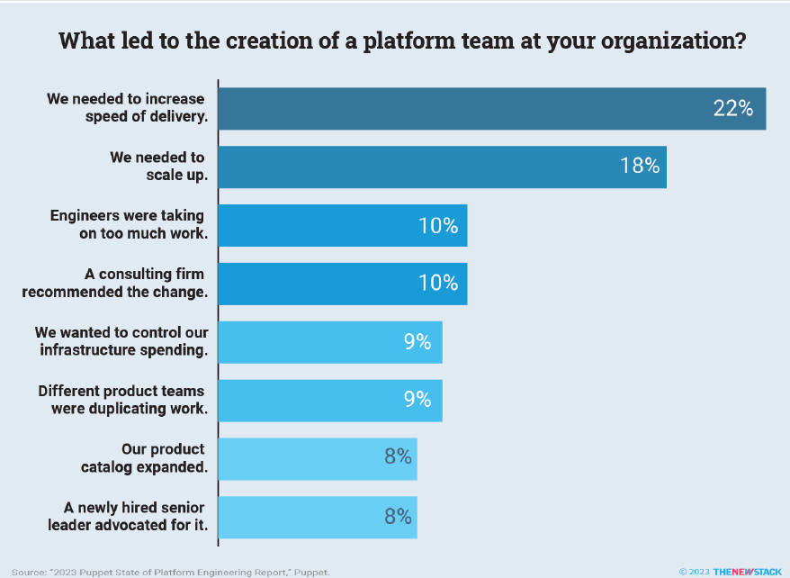
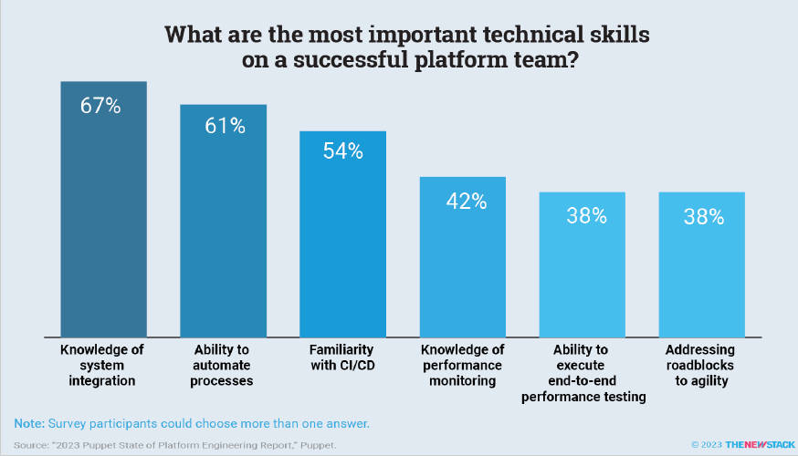

# 平台工程：您现在需要知道的

**The New Stack**

**Platform Engineering： What You Need to Know Now**
Alex Williams， Founder and Publisher

**Ebook Team：**
Andrew Tillery， Digital Marketing Manager
Ben Kubany， Project Manager
Celeste Malia， Marketing Consultant
Diana Gonçalves Osterfeld， Designer
Heather Joslyn， Ebook Editor
Jennifer Riggins， Author
Judy Williams， Copy Editor

**Supporting Team：**
Benjamin Ball， Director of Sales and Account Management
Joab Jackson， Editor-in-Chief
Michelle Maher， Assistant Editor
Vinay Shastry， Director of DevOps

© 2023 The New Stack. All rights reserved.

**中文翻译**

云云众生： [https://yylives.cc/](https://yylives.cc/)  
公众号： 云云众生s

## 赞助商

我们感谢我们的电子书赞助商：

**任何应用，每个云，一个模块化平台**

按您自己的条款进行创新。VMware Tanzu 使开发人员能够通过提供更快、更安全的生产路径并在大规模自动化平台操作来专注于构建出色的应用程序。

## 介绍

DevOps 运动兴起已经有 15 年的历史了，它承诺帮助团队更快地响应客户需求。理论上，[DevOps](https：//thenewstack.io/devops/？utm_source=thenewstack&utm_medium=ebook&utm_campaign=Series12Book1) 可以帮助软件团队“快速行动并打破常规”，并通过更少的资源做更多的事情。

但在现实中，大多数组织都[处于转型的中间阶段](https：//cloud.google.com/blog/products/devops-sre/the-2023-accelerate-state-of-devops-survey-is-open？utm_source=thenewstack&utm_medium=ebook&utm_campaign=Series12Book1)，选择的工具变得难以管理。与此同时，根据 2023 年 CD 基金会的数据，[开发人员的生产力显着增长](https：//thenewstack.io/is-devops-tool-complexity-slowing-down-developer-velocity/？utm_source=thenewstack&utm_medium=ebook&utm_campaign=Series12Book1)。这不仅对个人，也让组织付出了代价。

[开发人员以天文数字的速度增长](https：//www.sciencedirect.com/science/article/pii/S0950584922002257？utm_source=thenewstack&utm_medium=ebook&utm_campaign=Series12Book1)。[网络安全攻击正在呈指数增长](https：//www.forbes.com/sites/chuckbrooks/2022/06/03/alarming-cyber-statistics-for-mid-year-2022-that-you-need-to-know/？utm_source=thenewstack&utm_medium=ebook&utm_campaign=Series12Book1&sh=a022bb77864a)。过度的自治会危及您的团队和组织的可持续发展。作为对过于复杂的系统和流程的响应，团队会绕过问题进行工程化解决方案。这种方式不可扩展，并且往往会分散他们向最终用户交付业务价值的注意力。

那么解决方案是什么呢？对越来越多的组织来说，答案是[平台工程](https：//thenewstack.io/platform-engineering/?utm_source=thenewstack&utm_medium=ebook&utm_campaign=Series12Book1)。

平台工程是一套社会技术实践和工具，可以使开发人员和运维人员的生活都变得更轻松。通过使用内部开发人员平台、门户或工作流程来标准化开发人员构建、交付和部署其代码的方式，平台工程使他们能够提供自己的基础设施，并将复杂性抽象出来。

平台工程强调可发现性、可扩展性和自助服务，旨在为开发人员提供他们需要的一切，以便安全地将其代码交付给最终用户，并在需要时快速回滚。

从可观测性、监控和故障排除到合规性和安全性，开发人员平台旨在自动化任何阻碍开发人员更快地向最终客户交付价值的障碍。

一个平台团队(有时称为开发人员启用团队)采用“[平台即产品](https：//tanzu.vmware.com/content/white-papers/why-you-should-treat-platform-as-a-product?utm_source=TNS&utm_content=TNSplatformebook?utm_source=thenewstack&utm_medium=ebook&utm_campaign=Series12Book1)”的方法。它将组织内的开发人员视为其“客户”，并专门关注改进跨公司的内部开发人员体验，始终寻找方法来减少摩擦、沮丧和重复性工作。

简而言之：在平台工程中，开发人员不需要对 Kubernetes 有深入的了解；平台工程师创建易于复制的解决方案，并使自己免于不必要的辛苦。

越来越多的组织正在广泛采用平台工程。根据 Gartner 的预测，[到 2026 年, 80% 的软件工程组织将建立平台团队](https://www.gartner.com/en/articles/what-is-platform-engineering?utm_source=thenewstack&utm_medium=ebook&utm_campaign=Series12Book1)。

采用平台工程的一个重要动机是云原生生态系统的广泛性和复杂性。这种新的方法指导开发人员遵循“黄金路径”推进发布，而不是让他们从不断扩大的工具宇宙中筛选自己的“[黄金路径](https://thenewstack.io/golden-paths-start-with-a-shift-left/?utm_source=thenewstack&utm_medium=ebook&utm_campaign=Series12Book1)”。平台工程师必须通过构建和内部营销开发人员实际需要的东西来吸引他们使用该平台。

平台工程也是使跨职能利益相关者保持一致的一种方式，它将开发人员与业务价值联系起来，并使高管层了解重要的工程成本中心。如果正确部署，平台策略还可以带来更安全可靠的软件。平台工程明显增加了开发人员的生产力，同时减少了认知负载。

*图 0.1 在参与调查的受访者中，42% 的人表示平台工程对于开发者速率的提升“非常大”。*

事实上，在“ [2023 Puppet 平台工程状况报告](https://www.puppet.com/resources/state-of-platform-engineering?utm_source=thenewstack&utm_medium=ebook&utm_campaign=Series12Book1)”的调查中，93% 的企业认为采用平台工程思维将是整个组织朝正确方向迈出的一步，尽管只有大约一半的企业采取了这一步。

随着越来越多的组织采用某种形式的平台工程，您可以学习他们在消除障碍和激发开发者创造力和解决问题的潜力方面的最佳实践。通过改进开发人员体验，您最终会改善最终用户体验。

## 第一章 为什么平台工程正在兴起

平台工程难道不是 DevOps 的[重新包装](https://thenewstack.io/platform-engineering-wont-kill-the-devops-star/?utm_source=thenewstack&utm_medium=ebook&utm_campaign=Series12Book1)吗？这个问题很公平。毕竟，从本质上看，平台工程的目标似乎[与 DevOps 的三种方式](https://itrevolution.com/articles/the-three-ways-principles-underpinning-devops/?utm_source=thenewstack&utm_medium=ebook&utm_campaign=Series12Book1)相呼应：

- 优化端到端业务价值的流程。
- 缩短反馈循环。
- 持续实验、学习和改进。

一个良好的平台团队在处理组织内部的开发人员时，会反映这种 DevOps 思维方式 - 将他们视为客户 - 并寻求消除开发团队在实现这三种方式时面临的障碍。两种实践的成功都取决于自动化、跨职能协作和同理心，以帮助团队扩展复杂的分布式系统。

的确，平台工程的技术方面大部分遵循 DevOps，强调围绕有限的选择进行标准化、基础设施交付的自动化以及尽可能自助服务。不再需要正式的供应流程来获取更多的 CPU 或其他容器，只需等待数小时，如果不是几天的手工审批。

尽管 DevOps 旨在减少操作摩擦，提高跨部门速度，但平台工程则致力于提升开发者体验。这使得 DevOps 绝对是解决方案的一部分，但它本身也是问题的一部分。

DevOps 和[持续交付](https://thenewstack.io/ci-cd/?utm_source=thenewstack&utm_medium=ebook&utm_campaign=Series12Book1)导致了一直延伸到云的更长的流水线和工具链，这使得开发团队需要负责多达七层的复杂性并理解每个层面。再加上“左移”的趋势，它给开发者更多的应用安全责任。结果就是很大的认知负载。

“向‘左移’的运动迫使开发者对越来越多复杂的工具和工作流程有端到端的理解”，[平台工程社区](https://platformengineering.org/?utm_source=thenewstack&utm_medium=ebook&utm_campaign=Series12Book1)创建者 Luca Galante 说。“这些工具通常以基础设施为中心，这意味着开发者必须考虑他们的工作负载运行的平台和工具。”

*图1.1 开发者速度和扩展需求是组织创建平台团队的最常见原因。*

### 是什么拖累了开发人员

平台工程提出了一个新的论点：基础设施根本不是开发人员应该担心的事情。并非每个开发人员都想学习如何驾驭 Kubernetes 或云。

随着与日益云原生的技术栈的互动，开发人员必须不断切换上下文。应用程序团队在试图执行 DevOps 时会分心和压力太大，这会占用他们向最终用户交付业务价值的大量时间。然后，运维团队的流程会被永无止境的任务中断，这些任务通常可以并且应该自动化。

尽管 DevOps 这个词中有 “Dev”，但它的初衷是侧重于运营体验。但在现实中，DevOps 中有很多开发工作。它的实现方式是，虽然增加了 ops 的速度和可靠性，但分散了许多开发人员的注意力，其中有[惊人的 84% 的开发人员](https://thenewstack.io/is-devops-tool-complexity-slowing-down-developer-velocity/?utm_source=thenewstack&utm_medium=ebook&utm_campaign=Series12Book1)表示他们参与了 DevOps 活动，根据 2023 年 CD 基金会的调查。

因此，DevOps 的实施没有实现其加快跨职能、精简团队共同更快交付价值的承诺。隔阂依然存在。

“如果您询问任何一个工程团队，问他们：是什么减慢了你们的速度？大多数团队会说，一切都很顺利，直到我们需要与另一个团队进行互动，” Atlassian 的高级技术传播者 Andrew Boyagi 告诉 The New Stack。 

“他们需要弄清楚其他团队是谁。他们必须找出如何与他们互动的方法。通常，这种‘协作’的开始阶段就是非常低价值的，因为它就像：这个微服务是什么？它是否健康？它的运行手册在哪里？架构图在哪里？”

采用平台的另一个常见障碍是缺乏足够的文档，我们知道它极大地支持开发人员的入门和自助服务，但在内部平台策略中它往往是一个事后的想法。(请参阅第 2 章了解更多信息)。

即使 DevOps 革命已经进行了 15 年，根据 Puppet 的数据，[80% 的组织认为他们的 DevOps 之旅才进行到一半左右](https://www.puppet.com/resources/state-of-platform-engineering?utm_source=thenewstack&utm_medium=ebook&utm_campaign=Series12Book1)。

这部分原因是因为 DevOps 也是一个社会技术过程，许多组织仅仅关注采用自动化实践和基础设施即代码。开发人员体验完全从大多数所谓的 DevOps 转型中丢失。

另一方面，平台工程旨在使开发与运维以及安全性、合规性和高级 IT 和业务利益相关者保持一致。在关注开发人员体验的同时，它也有助于减少运维的苦差事，并帮助创建更快、更安全的生产路径。

平台工程团队可以帮助企业规模上实现 DevOps 的承诺。通过首先关注开发人员然后向下工作到基础设施，该团队可以创建一个内聚的、自助式的开发人员体验，这可以减少摩擦并提高交付价值的速度，从而加速 DevOps 主导的流程、反馈和实验。

> 如果你询问任何一个工程团队,问他们：是什么减慢了你们的速度？大多数团队会说，一切都很顺利，直到我们需要与另一个团队进行互动。"— Atlassian 的 Andrew Boyagi 说。

如果做得好，平台工程可以减少目前[三分之一以上开发者](https://stackoverflow.blog/2022/05/09/new-data-developers-and-prioritizing-wellness-at-work/?utm_source=thenewstack&utm_medium=ebook&utm_campaign=Series12Book1)所承受的认知负载和随之而来的职业倦怠。我们长期以来就知道，[更快乐的员工是更具生产力的员工](https://www.frontiersin.org/articles/10.3389/fpsyg.2020.00456/full?utm_source=thenewstack&utm_medium=ebook&utm_campaign=Series12Book1)，他们可以更快地创造性地解决客户的问题。

事实上，[VMware 在 2022 年的高管脉动调查](https://www.vmware.com/nl/company/digital-first-enterprise-research-insights.html?utm_source=thenewstack&utm_medium=ebook&utm_campaign=Series12Book1)中发现，被调查的企业技术高管中有一半表示，改善开发者体验对其组织增收潜力最大。

一个关注开发者优先的平台工程思维和自助服务策略，可以帮助最终解锁 DevOps 成熟度。通过改进开发者体验，您更有可能招募和保留杰出人才。

## 第二章 开始：组织文化

[“平台即产品”](https://tanzu.vmware.com/content/white-papers/why-you-should-treat-platform-as-a-product?utm_source=TNS&utm_content=TNSplatformebook%3Futm_source&utm_medium=ebook&utm_campaign=Series12Book1)的思维方式，由 Manuel Pais 和 Matthew Skelton 共同创造，正如他们在 2019 年出版的[《团队拓扑》](https://thenewstack.io/how-team-topologies-supports-platform-engineering/?utm_source=thenewstack&utm_medium=ebook&utm_campaign=Series12Book1)一书中所述，意味着将您的内部开发人员平台项目视为产品，并将您的内部开发人员视为您的客户。

这可能意味着您的组织需要进行重大文化变革。但这样的转变对任何平台工程计划的成功都至关重要。

“我发现人们会过于固执于新的创新技术，但他们会忽略他们正在为之构建的人，” OpenCredo 公司的首席执行官兼首席技术官 Nicki Watt [在 State of Open Con 上说](https://thenewstack.io/how-to-foster-a-good-internal-developer-platform-experience/?utm_source=thenewstack&utm_medium=ebook&utm_campaign=Series12Book1)。

Jürgen Sußner，[DATEV](https://tanzu.vmware.com/customers/datev?utm_source=thenewstack&utm_medium=ebook&utm_campaign=Series12Book1) 的首席云平台工程师，DATEV 是一家为德国税务顾问提供 IT 服务的服务提供商，拥有超过 1,700 名开发人员，也表达了同样的观点。

他告诉 The New Stack：“仅靠技术是不够的，你必须关心人。” 他说：“我的角色是摆脱开发人员的障碍，赋予他们以自己的速度交付软件的能力，中间没有任何障碍。”

为了[使其数据中心运营现代化](https://tanzu.vmware.com/customers/datev?utm_source=thenewstack&utm_medium=ebook&utm_campaign=Series12Book1)，提高开发人员更快、更自主地构建和交付软件的能力，DATEV 在 VxRail 上部署了 VMware Cloud Foundation，以创建一个可扩展的、自动化的混合云平台，通过 VMware Tanzu 实现。

许多平台工程专家建议您的内部平台项目应该有：

- 产品负责人。
- 用户研究。
- 客户角色。
- 产品路线图和 Backlog。
- 紧密的反馈循环。
- 营销或传播。
- 服务级目标(SLO)。

通过将您的平台视为产品，您将始终优先考虑内部消费者(开发人员)，同时将一切与业务目标保持一致。

*图 2.1 平台团队特别需要理解系统集成、自动化和持续集成/持续开发（CI/CD）的成员。*

### 收集反馈，获得移情

平台工程师毕竟是工程师，很容易落入自以为是的坏习惯。但必须抵制这种冲动。每个组织都需要找出如何通过紧密的反馈循环与其内部客户(也称为开发人员)进行互动的方法。

一些平台团队将自己的工程师嵌入应用程序团队中或进行结对编程，以第一手获得开发人员体验的同理心。这也可以帮助您尽早绘制用户旅程图 - 并识别阻碍它的瓶颈 - 尽早。

当身份安全公司 CyberArk 的平台团队引导组织从本地部署向云端迁移时，一部分平台工程师被委托构建一个位于平台之上的应用程序，充当首批试验用户。像这样的自我试用是建立对客户的共鸣的绝佳方式。

CyberArk 还采用了内部开源的文化。如果要构建一个新服务，请求应用程序团队可以选择 “借出” 一两个开发人员几个月到平台团队，以帮助构建该功能。然后，平台团队会负责在整个公司进行展开并维护它。这也有可能吸引平台倡导者，他们可以在返回应用程序开发时鼓励采用。

但请记住：开发人员不是唯一的利益相关者。越来越多的数据科学家和机器学习工程师需要能够利用平台作为云的通道，他们应该是您的测试用户之一，因为他们的需求和基础知识不同。

总是在早期就与安全、隐私和治理利益相关者协商，因为不断发展的平台应支持他们的目标。并且，为了确保这个内部产品继续获得资金，并让您的开发人员了解他们如何推动业务价值，请确保您的路线图与整体业务目标相关联。

> 在 VMware 进行的 2022 年 Executive Pulse 调查中，半数企业技术高管表示，改善开发者体验对于提高组织的收入潜力最大。

Watt 指出，平台不是一次性的项目 - 团队会不断变化和适应，治理和流程不能一刀切。要求和加速的途径将不断演变。

她说：“如果你想构建一个真正出色的平台工程师开发者体验，将其视为一项整体的社会技术挑战。”

采用“[以产品为平台](https://tanzu.vmware.com/content/white-papers/why-you-should-treat-platform-as-a-product?utm_source=TNS&utm_content=TNSplatformebook?utm_source=thenewstack&utm_medium=ebook&utm_campaign=Series12Book1)”的思维方式是一个不错的第一步。

### 沟通提供背景

[平台即产品](https://tanzu.vmware.com/content/white-papers/why-you-should-treat-platform-as-a-product?utm_source=TNS&utm_content=TNSplatformebook?utm_source=thenewstack&utm_medium=ebook&utm_campaign=Series12Book1)从不只是越过部门墙。任何更改都必须进行良好的沟通，并针对不同的利益相关者受众进行定制。尽早制定正式的平台战略沟通策略，包括平台的内部营销计划。

不用担心，一旦您宣布打算构建更好的平台体验，您将不可避免地收到大量功能请求。

您的内部客户将希望看到产品路线图 - 不仅仅是什么，还有任何更新背后的原因和方法。为他们提供不同的反馈方式，反过来帮助您重新优先考虑 backlog。 

随着您构建和共享平台产品路线图，请确保考虑到可维护性。持续预算和长期愿景关于它如何使组织受益是区别于另一个平台和可持续平台策略的关键。

> 我的角色是摆脱开发者的障碍，赋予他们以自己的速度交付软件的能力，中间没有任何障碍。"— DATEV 的 Jürgen Sußner

平台团队往往只包含几个支持数百或数千名工程师的队友。重要的是要过度沟通您的优先事项及其背后的理由，因为您根本无法满足每个需求。您的工作是减轻开发人员的倦怠，而不是滋生您自己的职业倦怠。

您可能会发现的一个挑战是平台团队往往只由技术成员组成，他们不一定很适合内部营销。 

“我们的 PlatformOps 团队确实擅长进行变革。但我们组织的开发方面是否会以同样的紧迫感接受这种变革？”Great American Insurance Group(GAIG)的高级应用架构师 Jim Kohl 问道。

特别是在保险等受监管行业，开发人员不总能选择所使用的技术，但一个良好的平台工程思维旨在劝说而不是强推。这就是为什么 Kohl 告诉 The New Stack，他的赋能团队希望“产品化变革”，通过精心设计的沟通和工具打包变革，以创建活动来检测哪些项目会受到影响，采用“将变革作为产品”的思维方式。 

“我们的操作员是很棒的人，非常乐于助人，但在操作和开发之间的沟通中，一定会失传某些内容，”他说。

在他的团队成立之前帮助改善开发人员体验，他说，运营团队会在 Slack 上发布消息，如“这 100 个应用必须在明天之前进行这项更改”。这些请求有时会留下许多待回答的问题。

这就是为什么他的团队的首要任务是改善跨职能沟通，包括创建卓越中心、为每个重大变更创建知识库，以及可选但参与率很高的每月开发人员体验(DevEx)论坛。

> “整个黄金路径都是关于改善开发人员体验。它释放了头脑空间，它使变革成为产品，所以作为开发人员和团队，我们可以专注于尽可能快速和可维护地交付高质量的产品。从而，通过产品产生对我们所做工作的热爱。”——Jim Kohl， 大美国保险集团

Kohl 是 GAIG 所称的基础团队的早期创始人之一，他说：“因为我们所做的很多事情都是核心的。” 七名成员负责开发者体验，帮助构建跨功能流水线和自助应用程序开发工具。

这项基础工作支持驻留在 VMware Tanzu 开发者平台上的 20 个不同业务组织中的 350 个应用程序。

虽然 PlatformOps 团队使一切顺利运行，而安全团队执行合规性，基础团队则致力于最大限度地减少这两个团队之间的摩擦，以便开发团队可以交付产品。

### 文档驱动自助服务

想让您的内部开发人员客户感觉被重视？文档是证明您对平台的长期投资和教您的开发人员自助的关键。

[保持文档简单](https://tanzu.vmware.com/content/blog/5-steps-to-writing-better-documentation?utm_source=thenewstack&utm_medium=ebook&utm_campaign=Series12Book1)、可浏览和可搜索，以减少开发人员使用平台的摩擦为目标。文档支持自助服务和可发现性，这样您的平台团队可以专注于解决问题，而不是开放内部支持热线。

永远不要假设用户的基础知识。避免使用“简单”或“轻松”等语言，并采用术语表和内部入门指南。由于开发人员可能通过 API 与平台进行交互，不要忘记包括每个调用、参数和响应的示例以及常见错误代码。这将帮助您让更多团队开始使用您的平台，结果是，这将帮助团队让新开发人员上手。清晰且易于使用的文档还可以帮助您的 IT 和业务部门之间进行更好的沟通。

文档也非常适合内部开源。请确保您不仅记录平台，而且还可以让开发人员轻松提出问题并帮助您回答问题。毕竟，他们是核心用户。这也有助于回答“您如何用 Y 做 X”的问题，并提供有用的真实工作流程。

无论您如何处理文档，请确保文档编写对您的平台团队来说成为一种习惯。

### 成功案例带来更高的采用率

平台采纳的另一个有价值的沟通工具是成功案例。在线房屋买卖市场 Realtor.com 面临了采用平台工程的抵触情绪，因为开发人员担心它可能会增加由公司的增长引起的已经存在的复杂性。

为了赢得开发人员的支持，该平台团队专注于初期获胜，首先交付旨在快速创建积极示例的“平台即产品”。然后，团队调整这些初期成功案例以适应不同的开发人员体验，以说服内部用户信任和使用该平台。

对 Realtor.com 团队来说，一个成功案例不仅会强调技术成就，还会强调协作和跨职能决策制定。

请务必尽早并经常收集开发人员的反馈，以便您可以构建他们想要的东西，并找到那些可以领导您的整个工程组织来使用它的内部倡导者。

## 第三章 开始：技术

让我们从两个内部开发人员平台不应该是的东西开始。

首先，内部开发人员平台不应该是大杂烩。 

“这是我经常看到的反模式，其中平台成为所有内容的容器，只是一个巨大的混乱，没有所有权，没有重点，很多浪费，团队过载并处理大量优先级不高的东西”，“团队拓扑”合著者 [Manuel Pais 告诉 The New Stack](https://thenewstack.io/how-team-topologies-supports-platform-engineering/?utm_source=thenewstack&utm_medium=ebook&utm_campaign=Series12Book1)。

内部开发人员平台是您的内部开发人员的用户界面，因此它应该专注于他们需要完成工作的内容，不需要更多。

其次，平台不仅仅是 Kubernetes 抽象，尽管许多组织的[首次尝试](https://newsletter.cote.io/p/kubernetes-is-great-but-its-been?utm_source=thenewstack&utm_medium=ebook&utm_campaign=Series12Book1)仅仅是减轻开发人员对 Kubernetes 的深入理解的需要。

平台是一种持续变化的东西，它不断根据内部客户需求进行调整。这就是为什么最好从小处着手，而不是在打开客户沟通渠道并用早期胜利证明您的工作之前采用成熟的解决方案。

### 从“最薄可行平台”开始

在敏捷产品管理中，您会快速推出[最小可行产品(MVP)](https://thenewstack.io/building-an-minimum-viable-product-a-founders-guide-to-success/?utm_source=thenewstack&utm_medium=ebook&utm_campaign=Series12Book1)给目标客户，使用更小的发布周期和更紧密的反馈循环。这样，您可以尽早知道您是否正在构建他们实际想要使用的东西，如果不是，您可以快速改变尝试其他事情。

在内部，团队拓扑方法建议您应该从“最薄可行平台”(TVP)开始您的平台之旅。首先采取的行动应该旨在减少摩擦或认知负荷 - 最理想的是两者兼备。

> 内部开发者平台不应该是一个大杂烩，“平台变成了所有事物的容器，只是一个巨大的混乱，没有所有权，没有重点，很多浪费，”《团队拓扑》的合著者 Manuel Pais 说。

您的 TVP 可能根本不是一个平台，而是创建更好的文档或可搜索的知识库。您的 TVP 是任何首先强调自助服务和简化开发人员发布周期的第一步。它推动那些吸引更多人上船的早期成功故事。

然后，随着规模的扩大，Pais 说，您可以战略性地在该平台上构建，以促进内部凝聚力并提供一致的内部用户界面和体验。

### 清点您的工具

尽管使用相同的开箱即用解决方案，但没有两个平台会完全相同，因为它们都应该针对您自己组织的开发人员进行设计。

您构建的一切都应该由跨多个产品团队共享的瓶颈请求驱动，或者来自其他必不可少的利益相关者，如安全团队。

平台策略的常见支柱有：

- 跨架构增加标准化。
- 自助式开发人员体验。
- 自动化的 CI/CD 流水线和发布周期。
- 越来越高级的抽象。
- 保持某种开发人员自主权或选择权。

在您着手进行平台之旅时，您可能会发现您组织中的开发人员正在使用各种工具。您并不孤单。事实上，Puppet 的当前“[平台工程状况报告](https://www.puppet.com/resources/state-of-platform-engineering?utm_source=thenewstack&utm_medium=ebook&utm_campaign=Series12Book1)”发现，受访的大多数企业都在并行运行三到六个自助服务平台 - 甚至是互相冲突的。

您的首要目标是了解您的组织已经拥有了什么，通过与团队联系来了解他们的工具集及其用途。尽可能地自动化工具发现过程，但也打开这些沟通线路。

> “平台工程不是为您的创新沙箱和 1% 的开发人员影响者而生的。请努力构建一个帮助大多数开发人员以较少的努力实现更多目标的平台。

平台团队专注于通过处理 Abigail Bangser(Syntasso 的首席工程师)所[说的“非差异化但并非不重要的工作”](https://thenewstack.io/how-to-host-your-own-platform-as-a-product-workshop/?utm_source=thenewstack&utm_medium=ebook&utm_campaign=Series12Book1)来减少苦差事，这是一些跨团队的工作 - 如安全性、合规性和云部署。

自动化这项重要工作可以让开发人员有时间和头脑空间来关注更快地向最终客户交付他们的差异化价值。这也是为什么 Syntasso 的首席运营官 Paula Kennedy 告诉 The New Stack，她建议从查看 Jira 工单[开始](https://thenewstack.io/platform-engineering-wont-kill-the-devops-star/?utm_source=thenewstack&utm_medium=ebook&utm_campaign=Series12Book1)您的平台之旅，以发现跨组织重复工作的模式。

发布周期或配置常被视为跨组织标准化的沃土 - [以及通常的投诉来源](https://tanzu.vmware.com/developer/learningpaths/developer-toil/developer-toil-audit/?utm_source=thenewstack&utm_medium=ebook&utm_campaign=Series12Book1) - 是否需要更多数据库容量或云中的 CPU。

### 精简就是游戏的名字

在一份专有报告中，Gartner 建议内部开发人员门户 - 平台工程团队策划的统一开发人员工具链接口 - 应统一各种平台功能。它将平台工程过程分为三个方面：

- **发现和创建**：搜索功能、集成开发环境、特定于团队的工具箱、软件组件目录、模板和文档。
- **集成和展示**：CI/CD 流水线、基础设施自动化、数据基础设施、API 生命周期管理、角色和权限以及环境管理。
- **操作和改进**：监控和可观测性、资源使用情况、安全性和合规性自动化、弹性工程、配置管理和事件管理。

该平台应该旨在简化整个软件交付过程，使开发人员将代码安全地发布到预生产和生产环境变得尽可能简单、自助服务和自动化。

虽然平台团队的重点是开发人员，但请务必与您的运维团队交谈。通过平滑开发人员的体验，您也应该减少运维工程师的苦差事。

随着[云原生工具选择](https://landscape.cncf.io/?utm_source=thenewstack&utm_medium=ebook&utm_campaign=Series12Book1)攀升至数千之多，钟摆再次向回摆动，从极端开发人员自治的时代转向一个平台为开发人员提供少量选择的时代。平台的目的在于提供护栏而不是大门，就像 Netflix 所说的那样。你的平台不应该阻碍创新。

只需记住，平台并不适用于所有人。它适用于 Postman 的产品负责人、可观测性 Jean Yang 所说的 99% 开发人员 - 而不是像 Facebook、Apple 和其他大型技术组织这样的尖端公司，而是部署在内部架构的大多数开发人员，混合使用旧架构。

平台工程不是为您的创新沙箱和 1% 的开发人员影响者而生的。您仍希望他们在新技术和流程上进行安全实验。谁知道，他们的实验可能会成为您有朝一日在整个公司实施的最佳实践。但就目前而言，请努力构建一个帮助大多数开发人员以较少的努力实现更多目标的平台。

### API 网关和服务目录

如前所述，您的组织最终可能会运行多个平台。一个平台可以从基本抽象或 Confluence 页面开始，一直到全面采用平台即服务等平台工程工具的定制、开源和/或开箱即用采用。

平台工程计划通常会从 API 网关或服务目录开始，以帮助促进发现和重用。平台工具概览包括：

- [开发人员门户](https://thenewstack.io/internal-developer-portal-what-it-is-and-why-you-need-one/?utm_source=thenewstack&utm_medium=ebook&utm_campaign=Series12Book1)，如 Configure8 和 Port，是平台上方的用户界面，支持自助服务。[Backstage](https://backstage.spotify.com/?utm_source=thenewstack&utm_medium=ebook&utm_campaign=Series12Book1) 是[流媒体公司 Spotify 创建](https://thenewstack.io/how-spotlify-adopted-platform-engineering-culture/?utm_source=thenewstack&utm_medium=ebook&utm_campaign=Series12Book1)的开源开发人员目录产品，它提供描述和可视化软件系统的模型。
- 代码存储库如 GitHub 在单个用户界面后面越来越多地包含开发人员生命周期。而且，由于大多数开发人员已经将工作提交给这样的代码存储库，所以他们不必学习新的工具即可使用它。
- [Cloud Foundry](https://www.cloudfoundry.org/?utm_source=thenewstack&utm_medium=ebook&utm_campaign=Series12Book1) 也是开源的，最初是 VMware 于 2011 年开发的，它是 [VMware Tanzu 应用程序服务](https://tanzu.vmware.com/application-service?utm_source=thenewstack&utm_medium=ebook&utm_campaign=Series12Book1)的基础。VMware Tanzu 应用程序服务是一个集成的平台即服务，包括开发人员门户、后台服务、应用程序部署工具和云原生运行时。

从一开始，重要的是不要被过于限定的一个品牌或工具所束缚。随着客户反馈的涌入，你需要灵活性和敏捷性。

除了处理横跨组织的那些重要但不差异化的工作之外，平台的关键职责是策划用户体验。

采取多平台路线并不罕见，事实上由于许多行业具体的规定，需要隔离服务和环境。关键是要抽象出支持自助服务的统一开发体验背后的复杂性。

无论您选择或构建哪种工具包，重要的是将内部开发人员视为您的客户。

## 第四章 为什么产品管理很重要

平台团队应该完全采用产品管理。这意味着团队有一个产品负责人，他会使其他成员保持对内部客户的关注，同时将工程与业务目标联系起来。

[Puppet 的平台工程调查发现](https://www.puppet.com/resources/state-of-platform-engineering?utm_source=thenewstack&utm_medium=ebook&utm_campaign=Series12Book1)，平台团队的顶级优先事项与产品管理职责交叉：

- 增加对平台功能的认识(47%)。
- 在整个组织中为平台团队的角色设定现实的期望(44%)。
- 更紧密地遵循行业趋势并跟上功能需求(37%)。

即使平台团队很小，也必须明确指派某人内部营销和宣传该产品，在推出新功能时进行公告，尤其是为什么。

此外，除了通常的沟通渠道(如 Slack、演示日和午餐学习会)之外，最好让您的消费者在团队内有一个联络人。

充分利用自助服务以不断改进产品。使用内部客户沟通来开发从客户到平台团队的反馈渠道。

“平台即产品”的思维方式不仅与产品有关，还与产品管理有关。虽然平台工程侧重于创建开发人员可以选择加入的服务目录，但通过平台团队进行集中管理也很重要。

ING 以艰难的方式学习了这个教训。虽然这家荷兰金融服务公司的平台团队能够通过开发者目录中的数百个可重用组件显着提高上市时间，但将这些服务集成在一起的复杂性以及在手动、重复配置上花费的时间只会大大拖慢开发者体验。

“工程师们不知道从哪里开始，接下来要做什么，谁来说话，[以及] 当他们集成服务时，平台的哪个团队正在提供各个部分，”ING 产品负责人 Amir Abadir [在 2023 年的 PlatformCon](https://thenewstack.io/how-ing-cut-time-to-market-via-a-better-developer-experience/?utm_source=thenewstack&utm_medium=ebook&utm_campaign=Series12Book1) 上说。“这导致一个不连贯的体验。”

平台导向的配置和控制创建了新的步骤和障碍，这意味着进入生产仍然需要六个月的时间。他的团队意识到需要重新关注平台策略，以交付更统一的用户体验，这反过来才能作为加速器。

“我们开发者的整体体验比我们作为平台提供者将其视为一组单独服务更重要”，Abadir 说。“我们的成功取决于平台的整体体验，而不是被隔离开发的产品。”

## 第五章 平台工程与安全

平台的目标是培养一种让“做正确的事情，做直观的事情”的体验，根据 Gartner 的分析师 Manjunath Bhat 的说法。

尽管平台工程的大部分工作致力于开发团队，但“做正确的事情”可以扩展到使整个软件供应链更安全合规 — 也有望自动实现。

但 Bhat 在 [Gartner 的一份报告](https://tanzu.vmware.com/content/ebooks/a-guide-to-turning-developer-experience-into-a-competitive-edge)中写道，这需要平衡，开发者门户在不牺牲敏捷性的情况下实施治理，并通过内置的防护措施促进自助服务云访问，同时仍能实现快速交付和创新。

### 保障流水线安全的最佳实践

那么，在平台工程下使流水线更安全需要做些什么呢？

“[安全的软件供应链](https://thenewstack.io/build-software-supply-chain-trust-with-a-devsecops-platform/?utm_source=thenewstack&utm_medium=ebook&utm_campaign=Series12Book1)意味着您拥有自动化构建流水线，您还可以自动化如何配置和打包应用程序进行部署并在生产环境中运行”，VMware 高级技术员 Michael Coté 说。

要开始创建更安全的开发人员发布生命周期，他建议检查已经集成到流水线中的所有第三方软件组件，以确保“它们足够安全，我们可以编目它们，记录它们的修补程序级别。”

然后需要记录这些决策以创建审计跟踪，这可以证明符合法规和标准。

随着平台团队努力确保软件链的安全性，也要查找所有组件 - 包括使用的库、依赖的服务、配置 - 并“在通过构建流水线时检查它们，确保您正在构建安全的软件”，Coté 说。

他继续说，这意味着“您不会部署包含已知问题的第三方库，然后您的审计日志让您可以验证人们是否遵循您制定的策略，是否遵循良好的安全行为。”

> 根据 VMware 的 Michael Coté ，确保平台自动化构建流水线的安全包括清点组织使用的所有第三方软件，检查其补丁状态并记录所有决策以创建审计跟踪。

“当您自动化这个安全价值流时，修补某些内容应该会变得容易得多，速度也会快得多，”他说。

因此，沟通安全性也应该至少在某种程度上通过平台团队进行。

在 GAIG，“我们与安全部门合作”，Kohl 说。 “我们与他们合作推出工具，并利用这些工具的发现来提高对安全威胁的认识 - 我们希望他们担心以前认为可以理所当然的事情。”

通过自助可视化内置在平台中有助于开发人员不仅知道存在漏洞，还应该帮助他们找到并展示如何修复它。

随着 GAIG 试图从内部转向公有云，这变得更加重要。 Kohl 说，“这确实提高了门槛。 您必须改变威胁建模和安全方法。”

虽然 GAIG 的基础团队成员与安全团队合作，但他们仍然是开发团队的监护人。这意味着他们需要评估云迁移以及他们所在行业必须遵循的必要限制是否会使开发人员的工作变得更快、更慢或保持不变。

## 第六章 量化开发人员体验

科学长期以来一直教导我们，您无法改进您无法测量的东西。 跟踪平台工程计划的成熟度对其成功至关重要。

测量任何技术成功的最佳方法是向目标受众征求反馈。 幸运的是，您的内部开发人员客户非常方便 - 有些甚至与您在同一楼层工作，肯定在与您相同的 Slack 频道中。

但还有更结构化的方法来测量 DevEx。

例如，2023 年计算机协会的一篇研究论文“ [DevEx：实际上是什么驱动生产力](https://queue.acm.org/detail.cfm?id=3595878?utm_source=thenewstack&utm_medium=ebook&utm_campaign=Series12Book1)”采用了以开发人员为中心的方法来测量和改善生产力。它研究了开发人员的生活体验以及他们每天遇到的磨擦，测量三个维度：

- **反馈循环**：开发人员完成工作的等待时间。
- **认知负载**：开发人员向客户交付他们创建的价值所需了解的内容。
- **流状态**：当开发者"进入状态"时，分散注意力有限，工作中充满目的感。

这些驱动因素基于 [25 个社会技术因素](https://ieeexplore.ieee.org/document/9785882?utm_source=thenewstack&utm_medium=ebook&utm_campaign=Series12Book1)，包括不现实的最后期限和不必要的中断(对 DevEx 有负面影响)以及编写良好的代码、明确的任务和开发人员相信他们擅长自己的工作(所有这些都对其有积极影响)。

这里，开发人员体验是通过定量数据源的组合来[测量](https://tanzu.vmware.com/developer/learningpaths/developer-toil/developer-toil-audit/?utm_source=thenewstack&utm_medium=ebook&utm_campaign=Series12Book1)的 - 如问题跟踪器、CI/CD 流水线和代码存储库 - 以及通过[半正式的匿名调查](https://theplatformspace.substack.com/p/designing-developer-surveys-the-final?utm_source=thenewstack&utm_medium=ebook&utm_campaign=Series12Book1)的定性方式。

另一个衡量客户成功的关键指标是净推荐值。 在业务中，NPS 测量客户推荐产品或服务的可能性。 [工程 NPS](https://gist.github.com/pjbollinger/6d89bc2511acb71533962c6165520746?utm_source=thenewstack&utm_medium=ebook&utm_campaign=Series12Book1) 询问：您有多大可能性推荐其他工程师在这里工作？ 这个简单的问题带来了大量的企业情绪和开发人员体验洞察。

坦诚的小组反馈会议也很有用。 Atlassian 的 Boyagi 和他的团队组建了工程团队负责人和工程师的焦点小组，定期询问：平台是否会减慢您的速度还是提高您的效率？ 我们可以在哪些方面改进？

您还可以要求应用团队在其回顾中纳入对平台的快速反馈。 然后，您可以关注平台对特定价值流的积极或消极影响。

> 开发者的喜悦来自于工作容易完成以及良好的文化支持的结合。平台工程的成功不仅取决于所构建的工具，还取决于它所服务的人。

但要记住，人的本性是在有机会时宣泄和抱怨的。Boyagi 警告说，未经指导的反馈通常会是负面的，因此应该将一切都视为改进的动力，理解平台团队不一定做错了什么。

对于平台团队来说，发现漏洞并回滚更改不仅需要提高发布速度，还需要提供减少恢复时间的方式（MTTR），这是平台团队跟踪的重要指标。

引入新开发者的时间作为另一个关键的 DevEx 指标。在 Spotify，成功的引入新开发者是通过新开发者执行第 10 次 pull request 来衡量的，因为 Spotify 已经确定这是开发者开始感到生产力的时候。在两年内，Spotify 通过使用时间引入新开发者的方法，将引入新开发者的时间从 110 天减少到 20 天。

### 创造“开发者愉悦”

“开发人员的快乐”来自易于完成的工作的组合以及支持它的伟大文化。 平台工程的成功不仅在于所构建的工具，还在于它所服务的人。

给程序员在其平台内提供一些选择也对产生开发人员的喜悦至关重要 - 让他们享受为组织构建所需应用程序的体验。

Fiserv 是一家为全球近 1 万家金融机构提供支持的金融科技提供商，它将 Fiserv 开发人员工作室作为其客户开发人员的自助门户。该工作室已从专有服务器迁移到由 [VMware Tanzu 应用程序平台](https://tanzu.vmware.com/application-platform?utm_source=thenewstack&utm_medium=ebook&utm_campaign=Series12Book1)支持的云中。

这家金融科技公司希望对其开发人员构建应用程序的方式保持治理，以使这些应用程序能够在多个云环境中启动。但它也希望让其产品的开发人员更容易随时随地供应所需的云基础架构。

此外，Fiserv 还寻求创建安全的沙箱环境，允许其开发人员进行实验。VMware Tanzu 应用程序平台中的 Cartographer 功能使 Fiserv 能够为其组织中的所有工程团队构建可以用于安全构建和发布流水线的蓝图，从而加速产品开发并扩展。

“[Cartographer 是游戏规则的改变者](https://tanzu.vmware.com/customers/fiserv?utm_source=thenewstack&utm_medium=ebook&utm_campaign=Series12Book1)，”Fiserv 数字技术转型 CTO Ganesh Venkataraman 在 VMware 的博客上告诉一位作者。“它为我们提供了一个可以在所有 Fiserv 团队中使用的一致供应链，而无需让他们被锁定在使用一种工具中。我们仍然拥有开发人员自由的基础，DevOps 体验则令人惊叹。”

Fiserv 开发人员工作室的运营还通过使用 [VMware Aria Operations for Applications](https://www.vmware.com/products/aria-operations-for-applications.html) 来合并可观测性。它提供分析和见解的高级可视性，有助于定位任何可能需要补救的微服务问题。

无论您采用哪种平台，请记住为开发人员的快乐而测量，Boyagi 建议。他将这种喜悦描述为开发人员体验和工程文化的混合。毕竟，诚实的反馈 - 实际上，您整个平台工程计划的成功 - 取决于心理安全，一个可以自由表达想法而不必害怕报复的环境。

“工程文化是工程组织内的价值观、实践和规范。影响这些的是领导力、决策过程、团队结构，”Boyagi 说。“一个健康的工程文化可以看出工程团队倡导协作、创新和持续学习。”

然后，开发人员的喜悦来自工作轻松和伟大文化的组合。 请记住，您的开发人员 - 您的内部客户 - 将决定您的平台工程策略的成功。

## 第七章 测量平台的成功

平台团队仍然需要自己的关键绩效指标来监控其进展。 这样的测量之一是平台的易操作性，检查的内容如：

- 总事件次数。
- 给定月份在事件上花费的时间。
- 服务级目标(SLO)或服务级指标(SLI)。
- 平均恢复时间(MTTR)。
- 未解决的关键安全漏洞数量。

对于像平台工程这样一个新生事物，也自然会寻找衡量您的发展进度的方法。 虽然 DevOps 主要依靠 DORA 指标 - 部署频率、变更引导时间、变更故障率和恢复服务时间 - 所有这些都会影响应用团队的速度，但需要一种更以开发人员为中心的方法来测量平台工程的产出。

**平台成熟度模型**

| 类别 | 说明 | 1 | 2 | 3 | 4 |
|---|---|---|---|---|---|
| 资金 | 公司如何看待(并因此资助)平台工作？ | 一次性 | 年度平台预算 | 平台团队预算 | 损益 |
| 采纳 | 是什么促使用户开始使用您的平台并取得成功？ | 强制 | 构建并迎接 | 内部倡导 | 平台倡导 |
| UX | 用户如何与您的平台交互并使用其服务？ | 人工请求队列 | 现成的产品 | 策划的入口 | 铺好的道路 |
| Backlog | 如何在您的平台上识别和优先考虑请求和需求？ | 响应式 | 定期 | 进化的 | 平台即产品 |
| 组织架构 | 产品工程如何管理非差异化的(并且往往在内部很常见)工具和基础设施？ | Dev 和 Ops | 全栈开发者 | 开发者使能 | 平台团队 |
| 跨功能展示 | 每个业务需求(例如合规性或性能)如何通过平台产品得到满足？ | 脱离平台 | 提供的工具 | 平台团队提供的自动化 | 专家驱动 |

*图7.1 遵循该模型的四级评分系统，作为衡量你的“平台即产品”进展的一种方式。*

Syntasso 团队开源了其[平台成熟度模型](https://www.syntasso.io/post/syntasso-donates-first-version-of-platform-maturity-model-to-cncf-working-group?utm_source=thenewstack&utm_medium=ebook&utm_campaign=Series12Book1)，该模型指导团队回答以下问题：

- 公司如何看待(并因此资助)平台工作？
- 是什么促使用户开始使用您的平台并取得成功？
- 用户如何与您的平台交互并使用其服务？
- 如何在您的平台上识别和优先考虑请求和需求？
- 产品工程如何管理非差异化的(并且往往在内部很常见)工具和基础设施？
- 每个业务需求(例如合规性或性能)如何通过平台产品得到满足？

对于这 6 个问题，都有 4 个阶段的回来来帮助评估您自己组织的平台发展阶段。

## 总结 保持平台工程的成功

最后，平台工程不是快速修复或灵丹妙药。 它需要持续投资 - 不管经济情况如何。 采用跨组织的“平台即产品”思维可以使团队用更少的资源做更多的事情。  

[Puppet 的调查](https://www.puppet.com/resources/state-of-platform-engineering?utm_source=thenewstack&utm_medium=ebook&utm_campaign=Series12Book1)显示，实施平台工程的时间越长，组织对其平台团队持续成功的信心就越高。 根据报告，开发人员生产力显着提高通常需要约 3 年 - 这与成功的云转换实现时间相当。

在该调查中有 71% 的受访者表示，他们的组织计划在未来一年或更早雇佣具有平台工程经验的人，这显示了组织对成功实施“平台即产品”策略的投资回报率充满信心。

您呢？

## 关于作者

[Jennifer Riggins](https://thenewstack.io/author/jennifer-riggins/?utm_source=thenewstack&utm_medium=ebook&utm_campaign=Series12Book1) 是一位技术文化故事讲述者、记者、作家和活动及播客主持人，帮助分享技术与文化碰撞的故事，并解释我们正在构建的技术的影响。她从 2003 年开始就是活跃的作家，目前驻扎在伦敦。

## 披露

本电子书中提到的以下公司是 The New Stack 的赞助商：Port、Puppet by Perforce 和 VMware。 

TNS 所有者 Insight Partners 是 Ambassador Labs、Apollo GraphQL、Devtron、Fermyon、Jit、Kasten、Kubeshop、LibLab、Roadie、SingleStore、Slim.AI、SonarSource、StormForge 和 Tigera 的投资者，这些公司也是 The New Stack 的赞助商。
